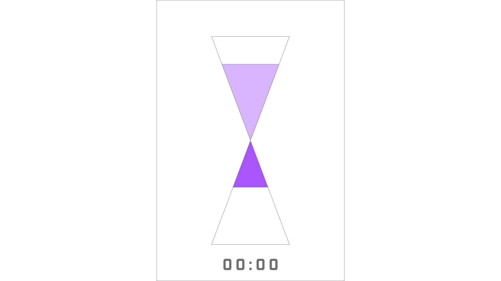

# timer  
simple timer for simple use.  
## Initial Prototyping  
  
Done in Adobe XD.  
### Actions  
  1. Starting  
 	  Scroll the upper half of the hourglass to adjust the amount of color to adjust hours.  
    Max to make it 30 minutes. Possibly in log.  
  2. Adjusting  
    Tap to pause.  
    Double tap to reset.  
